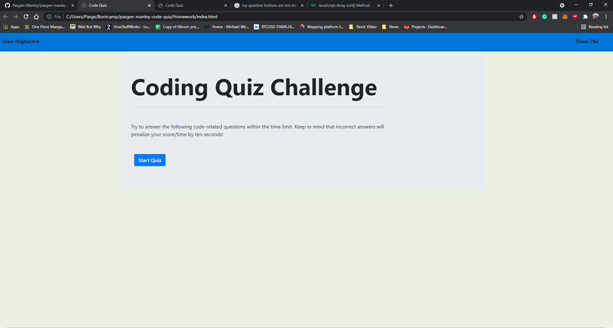
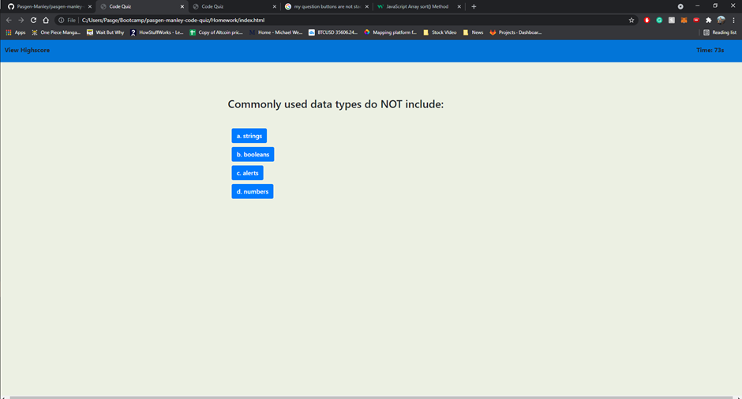
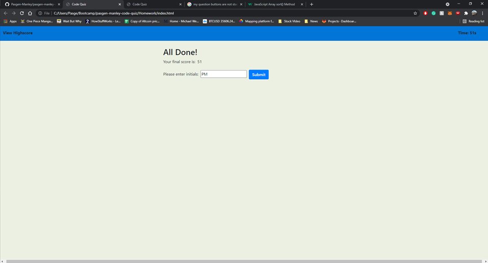
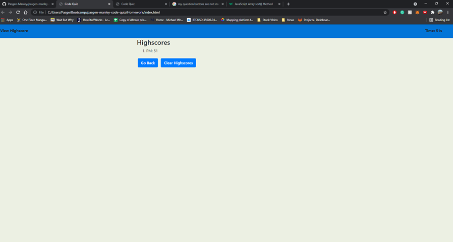

# pasgen-manley-code-quiz
## Deployed application

https://pasgen-manley.github.io/pasgen-manley-code-quiz/

### Project Description

The purpose of this assignment was to create an application that cycles through an array of questions and gives a score at the end of the quiz. Each time an incorrect answer has been entered the time is reduced by 10 seconds. The user score is determined by how quickly the quiz is completed. Once completed the user can enter his/her initials along with the score they received into a high score leaderboard. On the leaderboard section, there are also options to go back to the home page to redo the test, as well as a button that clears the score leaderboard.

#### Project screenshots

Home page of the application.

Example of how the questions are layed out.

Section where user inputs initials.

Example of how the leaderboard looks after initial's input
